Deployment Summary
==================

Purpose
-------

The purpose of this document is to describe the process used to deploy
the Azure-hosted components of the Digital Platform that is part of the
Microsoft Sports Platform.

This document begins describing the topology and components to be
deployed and then proceeds to describe the deployment process in detail.

Content
-------

The document is composed of the following sections.

-   **Summary**: This section contains a brief description of the
    purpose and provides the context of the document. It also provides
    an overall summary of the contents of this document.

-   **Deployment Scope**: This section includes a high-level description
    of the environment that will be created as a result of following the
    process in this document.

-   **Installation Strategy**: This section provides a summary of the
    decisions and conventions used while developing the deployment
    process.

-   **Deployment Resources**: This section contains a list of the
    resources you will need to run the deployment process.

-   **Digital Platform Build:** This section contains guidelines on how
    to build/compile the Digital Platform before running a deployment.
    This information is included for developers interested in deploying
    their own environment of the Digital Platform.

-   **Azure Setup Process:** This section describes the process that
    operators will need to deploy the Azure environment where the
    solution will run. This process will only be run when the topology
    of the solution changes.

-   **Release Deployment:** This section describes the process to be
    followed when a new version of the application or configuration
    needs to be deployed. It only updates the application, and does not
    change the general environment or its topology.

    1.  Intended Audience
        -----------------

The document is intended for operators, testers, and developers
responsible for deploying the solution, and for service managers in
charge of operating it.

This document may also be helpful to architects and product managers
looking to better understand the deployment of the solution.

Deployment Scope
================

This document provides guidance to install the pieces of the Digital
Platform hosted in Azure, not including the Analytics Platform.

Deployment Topology
-------------------

The environment created will have four deployments, as described in the
document **Physical Design.** These deployments will be in the following
Azure regions:

Update the table based on the locations and availability of your
deployment

  Deployment Region   Audience
  ------------------- ----------------------------------------------------------------------------------------------------------------------------------------------
  US West             This will target the main group of Fans and administrative users.
  US East             This will cover remote local users and will also provide administrative function.
  West Europe         Focused on European markets, no administrative capabilities will be deployed in this deployment.
  Japan West          Focused on Asian markets, no administrative capabilities will be deployed in this deployment and it will be the smallest of all deployments.

Components
----------

The following components will be deployed as part of this guide.

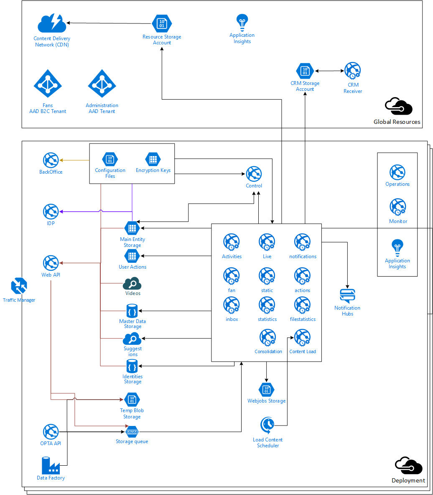

+-----------------------------------+-----------------------------------+
| Component                         | Description                       |
+===================================+===================================+
| BackOffice website                | The BackOffice website provides a |
|                                   | single page application that      |
|                                   | provides access to the management |
|                                   | functionality of the Web API.     |
|                                   |                                   |
|                                   | It is hosted in its own Azure Web |
|                                   | App because usage will be limited |
|                                   | to the customer's employees and   |
|                                   | it may not be necessary in all    |
|                                   | deployments.                      |
+-----------------------------------+-----------------------------------+
| Web API website                   | The Web API website hosts the     |
|                                   | REST service that exposes all     |
|                                   | Digital Platform functionality.   |
|                                   |                                   |
|                                   | This area is the main point of    |
|                                   | interaction in the platform and   |
|                                   | it will be present on all         |
|                                   | deployments as the front-end      |
|                                   | component that will scale the     |
|                                   | most.                             |
+-----------------------------------+-----------------------------------+
| Deployment storage                | The storage used to support       |
|                                   | Digital Platform functionality is |
|                                   | hosted in different types of      |
|                                   | storage depending on specific     |
|                                   | needs. During the deployment,     |
|                                   | Document DB Databases, Azure      |
|                                   | Storage accounts, and Azure       |
|                                   | Search Indexes will be created.   |
+-----------------------------------+-----------------------------------+
| Configuration storage             | The configuration of the          |
|                                   | environment will be stored in its |
|                                   | own repository as Azure Blobs     |
|                                   | encrypted during deployment.      |
|                                   |                                   |
|                                   | All applications will have the    |
|                                   | public key required to decrypt    |
|                                   | and validate the configuration    |
|                                   | files, but only the operations    |
|                                   | team will have control of the     |
|                                   | private key to avoid unmanaged    |
|                                   | changes.                          |
+-----------------------------------+-----------------------------------+
| Queue/temporal storage            | Queue storage is used for two     |
|                                   | reasons:                          |
|                                   |                                   |
|                                   | -   To support the asynchronous.  |
|                                   |     All actions request through   |
|                                   |     the Web API that impact and   |
|                                   |     change values are queued to   |
|                                   |     be processed by the different |
|                                   |     WebJobs.\                     |
|                                   |     In this case, the queue       |
|                                   |     allows the solution to scale  |
|                                   |     and avoid creating            |
|                                   |     bottlenecks in the users'     |
|                                   |     applications.\                |
|                                   |     Other scenarios where         |
|                                   |     asynchronous processing is    |
|                                   |     used include syncing          |
|                                   |     information to CRM Online and |
|                                   |     adding content to the Azure   |
|                                   |     Search indexes.               |
|                                   |                                   |
|                                   | -   To replicate and sync data    |
|                                   |     between different deployment. |
|                                   |     Each deployment will have     |
|                                   |     dedicated queues to send      |
|                                   |     commands that have to be      |
|                                   |     replicated to other           |
|                                   |     deployments.                  |
|                                   |                                   |
|                                   | The usage of Queues in the        |
|                                   | platform uses a sharding strategy |
|                                   | that enables using multiple       |
|                                   | queues for the same topic, which  |
|                                   | increases the scalability of the  |
|                                   | solution. You can expect to see   |
|                                   | multiple physical queues created  |
|                                   | per logical Queue.                |
+-----------------------------------+-----------------------------------+
| Notification Hub                  | Notification Hub is used to send  |
|                                   | notifications to mobile apps.     |
+-----------------------------------+-----------------------------------+
| Administration Azure Active       | This directory is used to manage  |
| Directory                         | all the customer's users that     |
|                                   | manage the platform. The Web API  |
|                                   | trusts this AAD and gives         |
|                                   | privileges to manage content to   |
|                                   | users that have valid roles in    |
|                                   | this tenant.                      |
+-----------------------------------+-----------------------------------+
| Fans Azure Active Directory B2C   | This directory provides the       |
|                                   | identity of the fans for the      |
|                                   | platform. It manages federation   |
|                                   | with social identities and        |
|                                   | provides its own repository of    |
|                                   | identities used when fans do not  |
|                                   | want to register or share their   |
|                                   | social identities.                |
|                                   |                                   |
|                                   | The Web API trusts this AAD B2C   |
|                                   | tenant to use the general         |
|                                   | services of the platform.         |
+-----------------------------------+-----------------------------------+
| WebJob control                    | This is a website that provides a |
|                                   | single point of control for all   |
|                                   | WebJobs running in the platform.  |
|                                   | This service takes care of making |
|                                   | the WebJobs aware of the sharding |
|                                   | used by the queues and implements |
|                                   | a heartbeat control that allows   |
|                                   | monitoring the state of the       |
|                                   | WebJobs.                          |
+-----------------------------------+-----------------------------------+
| WebJobs                           | Azure WebJobs are used to provide |
|                                   | offline processing capabilities   |
|                                   | to the platform. In most cases,   |
|                                   | the WebJobs are processing        |
|                                   | messages received through queues  |
|                                   | and they communicate with the     |
|                                   | WebJob Control to schedule their  |
|                                   | work and report their state.      |
|                                   |                                   |
|                                   | WebJobs are deployed in their own |
|                                   | app service hosting to avoid      |
|                                   | interference with the user facing |
|                                   | sites and to scale independently. |
+-----------------------------------+-----------------------------------+
| Application Insights              | Visual Studio Application         |
|                                   | Insights is used across the       |
|                                   | platform to provide support for   |
|                                   | two scenarios:                    |
|                                   |                                   |
|                                   | -   Telemetry. App Insights is    |
|                                   |     used in all components to     |
|                                   |     monitor and register the      |
|                                   |     state of the solution. This   |
|                                   |     information is used mostly to |
|                                   |     operate the platform.         |
|                                   |                                   |
|                                   | -   Usage of the platform. The    |
|                                   |     REST API and many of the      |
|                                   |     components use App Insights   |
|                                   |     to report the actions and     |
|                                   |     behavior of users. This       |
|                                   |     information provides a better |
|                                   |     understanding of the fans and |
|                                   |     the platform. Most of the     |
|                                   |     data generated in this case   |
|                                   |     is used by the Analytics      |
|                                   |     platform to provide insights  |
|                                   |     into the platform to the      |
|                                   |     business decision makers.     |
+-----------------------------------+-----------------------------------+
| Operation websites                | The operation websites provide    |
|                                   | simple web interfaces for the     |
|                                   | operations team to observe and    |
|                                   | review metrics and information    |
|                                   | collected in the deployment.      |
+-----------------------------------+-----------------------------------+
| CDN                               | The CDN edges used to provide the |
|                                   | content managed with the          |
|                                   | BackOffice will be created as     |
|                                   | part of the deployment.           |
+-----------------------------------+-----------------------------------+

Installation Strategy
=====================

The installation of a cloud-based solution has the clear advantage in
that it can be easily automated. The project has created different
artifacts that will be used to deploy the solution:

-   Deployment scripts. These PowerShell Scripts drive the deployment
    workflow and provide the logging capabilities to troubleshoot
    deployments.

<!-- -->

-   Resource templates. These JSON files define the resources created in
    the environment and are used as the input for the PowerShell
    Deployment Scripts.(Basically Configuration files)

-   Parameter files, these files contain a list of parameters for the
    environment being configured and are used to generate the Deployment
    and Configuration json files.

-   Custom provisioning operations. These custom [PowerShell
    CmdLets](https://technet.microsoft.com/en-us/library/dd772285.aspx)[^1^](#fn1){#fnref1
    .footnote-ref} are used to provide additional capabilities required
    to provision the environment.

    **The deployment scripts will drive the process, as described in
    this document: however the configuration of the environment is up to
    the team deploying the solution.** To improve the management and
    usability of the platform the following conventions are suggested
    for the installation/deployment of the solution:

-   Use a single resource group for deployment to simplify the
    management of every environment and make it simpler to remove failed
    or obsolete deployments.

-   Use a single resource group for global resources to provide a clear
    understanding of all resources being used by all deployments.(ARM)

-   Use the deployment ID in the name of the resource group and
    resources to make it clear to the deployment they belong to.

-   For the initial deployment, start with all deployments even though
    they may not be used. This best practice will simplify and validate
    the data replication topology.

-   Provide different units of scale for all web components, which will
    allow you to tune and grow the platform without having unexpected
    dependencies.

Deployment Resources
====================

Use this section to identify the staffing that will be needed to
complete the deployment and the sources of the personnel (internal
staff, contractors and so on).

To deploy a complete environment for the solution, the following
software must be set up:

-   **Microsoft Azure subscription**

-   **Microsoft .NET framework 4.6 or more**

-   **Microsoft Azure PowerShell 2.0.1 (Installer:** **link)**

-   **Microsoft Dynamics CRM Online Tenant**

-   **Microsoft Dynamics Social Listening Tenant**

-   **Microsoft Dynamics Marketing Tenant**

-   **Visual Studio Team Services Project (required for the build step;
    if you will simply be deploying the solution, you won't need it)**

You will need to have users that have access and permissions to execute
the following tasks:

-   Co-administrator of the Azure subscription where you will deploy the
    Digital Platform.

-   Global administrator of the Azure Active Directory Tenants if you
    will be using an existing AAD Tenant.

Azure AD tenants and Apps
=========================

This section walks you over the steps required to provision and
configure the Azure AD tenants and the apps that will be used by the
solution.

Azure AD Admin tenant
---------------------

This Azure AD (AAD) tenant will be used by the customer's personnel to
manage the platform. The creation of an AAD is at the subscription
level, which means your user must be a subscription co-administrator.

Create your own AAD tenant or ask the customer access to their existing
AAD tenant. Note down the domain name for the tenant you are creating
(xxx.onmicrosoft.com) and the tenant id (from the URL in the classic
azure portal)

[Create the following web
applications](https://azure.microsoft.com/en-us/documentation/articles/active-directory-integrating-applications/)
in the AAD Tenant.

**Note:** Web apps MUST have the implicit flow enabled as described
[here](#appendix-b-parameter-file-tokens).

**Note:** For multi-environment configurations, you can create a single
web application per each AAD tenant, and then specify as many Reply URLs
in the app's configuration screen as the number of your deployment
locations. And for the production environment you may always want to
have the Reply URL corresponding to the Traffic Manager URL.

**You also** need to create two roles[^2^](#fn2){#fnref2 .footnote-ref}
(***PlatformAdmin*** and ***ContentAdmin***) in both Web Admin and Web
API web applications that you'll be creating. The roles manifest is
available in Appendix A: Application Role Definition.

+-------------+-------------+-------------+-------------+-------------+
| Name        | Type        | SIGN-ON URL | APP ID URI  | Config      |
|             |             |             |             | Notes       |
+=============+=============+=============+=============+=============+
| MDP - Web   | Web App     | https://\[c | http://\[cu | Create a    |
| API         |             | ustId\]-\[e | stId\].digi | key and     |
|             |             | nv\]-\[regi | talplatform | copy it.    |
|             |             | on\]-web-ap | .ms/web/api | You will    |
|             |             | i.azurewebs |             | use in the  |
|             |             | ites.net/   |             | configurati |
|             |             |             |             | on          |
|             |             |             |             | file.       |
|             |             |             |             |             |
|             |             |             |             | Set User    |
|             |             |             |             | Assignment  |
|             |             |             |             | Required to |
|             |             |             |             | Access App  |
|             |             |             |             | to "YES"    |
+-------------+-------------+-------------+-------------+-------------+
| MDP - Web   | Web App     | https://\[c | http://\[cu | Grant       |
| Admin       |             | ustId\]-\[e | stId\].digi | delegated   |
|             |             | nv\]-\[regi | talplatform | access to   |
|             |             | on\]-web-ad | .ms/web/adm | the Web API |
|             |             | min.azurewe | in          | application |
|             |             | bsites.net  |             | ;           |
|             |             |             |             |             |
|             |             |             |             | Set User    |
|             |             |             |             | Assignment  |
|             |             |             |             | Required to |
|             |             |             |             | Access App  |
|             |             |             |             | to "YES"    |
+-------------+-------------+-------------+-------------+-------------+
| MDP - Web   | Web App     | https://\[c | http://\[cu | Create a    |
| Control     |             | ustId\]-\[e | stId\].digi | key and     |
|             |             | nv\]-\[regi | talplatform | copy it.    |
|             |             | on\]-web-co | .ms/web/con | You will    |
|             |             | ntrol.azure | trol        | use in the  |
|             |             | websites.ne |             | configurati |
|             |             | t           |             | on          |
|             |             |             |             | file.       |
+-------------+-------------+-------------+-------------+-------------+
| MDP - Web   | Web App     | https://\[c | http://\[cu | Grant       |
| Load        |             | ustId\]-\[e | stId\].digi | delegated   |
| Content Job |             | nv\]-\[regi | talplatform | access to   |
|             |             | on\]-web-lo | .ms/web/loa | the Web     |
|             |             | adcontent.a | dcontent    | Control     |
|             |             | zurewebsite |             | application |
|             |             | s.net       |             | .           |
|             |             |             |             |             |
|             |             |             |             | Create a    |
|             |             |             |             | key and     |
|             |             |             |             | copy it.    |
|             |             |             |             | You will    |
|             |             |             |             | use in the  |
|             |             |             |             | configurati |
|             |             |             |             | on          |
|             |             |             |             | file.       |
+-------------+-------------+-------------+-------------+-------------+
| MDP - Web   | Web App     | https://\[c | http://\[cu | Grant       |
| Operations  |             | ustId\]-\[e | stId\].digi | delegated   |
|             |             | nv\]-\[regi | talplatform | access to   |
|             |             | on\]-web-op | .ms/web/ope | Azure       |
|             |             | erations.az | rations     | Service     |
|             |             | urewebsites |             | Management  |
|             |             | .net        |             |             |
|             |             |             |             | Create a    |
|             |             |             |             | key and     |
|             |             |             |             | copy it.    |
|             |             |             |             | You will    |
|             |             |             |             | use in the  |
|             |             |             |             | configurati |
|             |             |             |             | on          |
|             |             |             |             | file.       |
+-------------+-------------+-------------+-------------+-------------+
| [[]{#OLE_LI | Native Apps | [http://loc |             | Set the     |
| NK8         |             | alhost](htt |             | redirect    |
| .anchor}]{# |             | p://localho |             | URL to      |
| OLE_LINK7   |             | st/)        |             | http://loca |
| .anchor}Pow |             |             |             | lhost.      |
| erShell     |             |             |             |             |
| Scripts     |             |             |             | Grant       |
|             |             |             |             | delegated   |
|             |             |             |             | access to   |
|             |             |             |             | the Web API |
|             |             |             |             | application |
|             |             |             |             | .           |
+-------------+-------------+-------------+-------------+-------------+

Assigning users and groups to application roles
-----------------------------------------------

After you upload all the manifests back to AAD, make sure the **User
Assignment Required To Access APP** control is enabled, and the users in
your Active Directory are assigned accordingly to their authorization
level (must be consulted with the customer). These roles must be
assigned for **Web API** and **Web Admin** applications.

Then, after a global administrator of the customer's organization has
added their users into the AAD directory, either they themselves or a
user accounts administrator in their organization can assign users and
groups to Sports applications: navigate to the users tab under the
application to which you would like to assign users and groups. Select a
user and click on the **Assign** action on the bottom bar. Here you can
assign the desired role to the user.

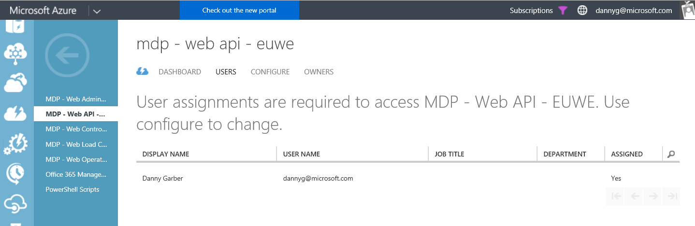

> 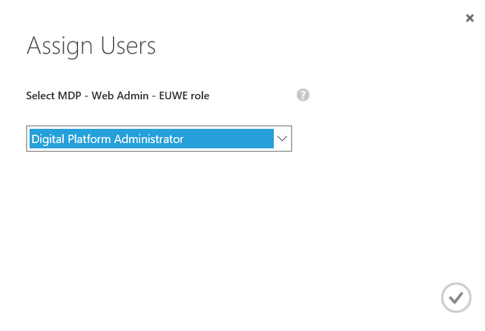

Azure AD B2C Fans tenant
------------------------

This Azure AD (AAD) tenant will be used by to provide a single identity
to all fans connecting to the platform. The creation of an AAD is at the
subscription level, which means your user must be a subscription
co-administrator.

1.  [Create an AAD B2C
    Tenant](https://azure.microsoft.com/en-us/documentation/articles/active-directory-b2c-get-started/).(Note
    down the tenant name (xxx.onmicrosoft.com) and tenant id .

2.  [Create the following custom
    attributes](https://azure.microsoft.com/en-us/documentation/articles/active-directory-b2c-reference-custom-attr/)
    to the User attributes collection. All names are case sensitive.

    To access the B2C settings click on the Manage B2C settings under
    the b2c Administration in the Configure page of the directory you
    just created:

    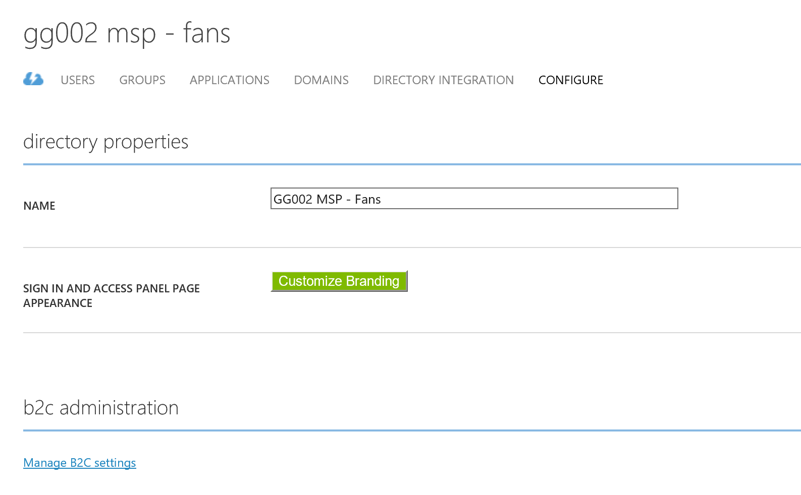

    Then, you can add a new custom attribute by accessing the collection
    of User Attributes as it is shown on the following screenshot:

    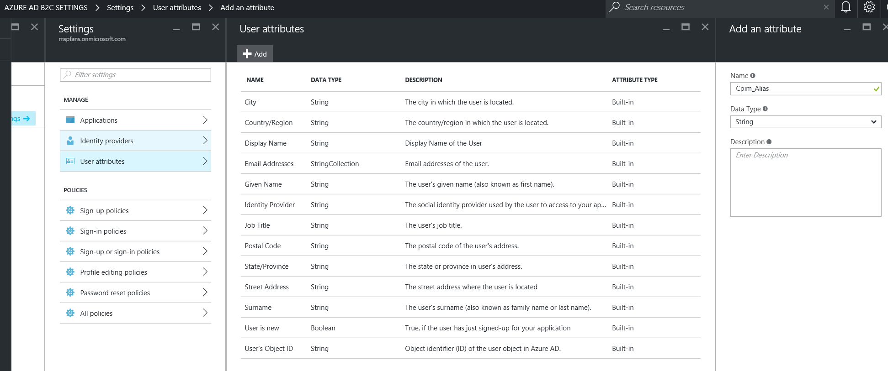

    The list of all custom attributes is listed below:

  Name                         Type
  ---------------------------- --------
  Cpim\_Alias                  String
  mdpCpim\_AvatarName          String
  Cpim\_AvatarThumbnailName    String
  Cpim\_BirthDate              String
  Cpim\_ContactEmail           String
  Cpim\_DisableDate            String
  Cpim\_DocumentNumber         String
  Cpim\_DocumentType           String
  cpim\_Email                  String
  Cpim\_FanCardType            String
  Cpim\_FanNumber              String
  Cpim\_Gender                 String
  Cpim\_HasAvatar              String
  Cpim\_IsActiveMember         String
  Cpim\_IsActivePaidFan        String
  Cpim\_Language               String
  Cpim\_LastPolicyAcceptDate   String
  Cpim\_LastUpdate             String
  Cpim\_MemberNumber           String
  Cpim\_MemberSeatId           String
  Cpim\_MobileNumber           String
  Cpim\_NoSendDataToThirds     String
  Cpim\_NoSendInfoData         String
  Cpim\_Penya                  String
  Cpim\_PictureUrl             String
  Cpim\_PreferenceSport        String
  Cpim\_RegistrationDate       String
  Cpim\_SecondName             String
  Cpim\_SendDataToThirds       String
  Cpim\_SendInfoData           String
  Cpim\_SendStoreInfoData      String
  Cpim\_Source                 String
  Cpim\_Title                  String

1.  [Create a "SignIn or SignUp"
    policy](https://azure.microsoft.com/en-us/documentation/articles/active-directory-b2c-reference-policies/),
    call it B2C\_1\_SignInSignUp and save the policy name to use them in
    the configuration file (the apps will use these policies during
    SignIn and Registration).

    For Sign-up policy you should add the following attributes:

    a.  **Identity providers**

        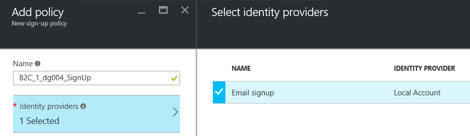

    b.  **Sign-up attributes:**

        It is recommended to use at least these fields in the Sign-up
        policy:

  NAME                         LABEL                      OPTIONAL   TYPE
  ---------------------------- -------------------------- ---------- ----------------------
  Cpim\_Language               Language                   No         DropdownSingleSelect
  Cpim\_LastPolicyAcceptDate                              No         TextBox
  Cpim\_LastUpdate                                        No         Text Box
  Cpim\_NoSendDataToThirds     Don\'t send data to 3rds   No         RadioSingleSelect
  Cpim\_NoSendInfoData         Don\'t send info           No         RadioSingleSelect
  Cpim\_RegistrationDate                                  No         Text Box
  Cpim\_SendStoreInfoData      Send store info            No         RadioSingleSelect
  Cpim\_Source                 Source                     Yes        TextBox
  Email Addresses              Email Addresses            No         TextBox

a.  **Application claims:**

    The minimum selected field requirements are: **Email Addresses** and
    **User's Object ID**, but you may consider adding the following
    claims must be selected:

  NAME
  --------------------------
  Cpim\_Language
  Cpim\_NoSendDataToThirds
  Cpim\_NoSendInfoData
  Cpim\_SendStoreInfoData
  Cpim\_Source
  Cpim\_SendInfoData
  Cpim\_SendDataToThirds
  Country/Region
  Display Name
  Email Addresses
  Given Name
  Identity Provider
  Surname
  User is new
  User's Object ID

a.  Leave all other settings **default.** Then click **Create**.

**Note:** You can add other attributes if needed, but consider that
adding too many fields may result in larger authentication codes and
errors during authentication.

1.  Create the following applications using the old azure portal:

+-----------------+-----------------+-----------------+-----------------+
| NAME            | TYPE            | Reply URL       | CONFIG NOTES    |
+=================+=================+=================+=================+
| MDP - Identity  | Web App         | https://\[custI | Create a key    |
| Provider        |                 | d\]-\[env\]-\[r | and copy it to  |
|                 |                 | egion\]-web-idp | be included in  |
|                 |                 | .azurewebsites. | the             |
|                 |                 | net             | configuration.  |
|                 |                 |                 |                 |
|                 |                 | App ID URI:     |                 |
|                 |                 |                 |                 |
|                 |                 | http://\[custId |                 |
|                 |                 | \].digitalplatf |                 |
|                 |                 | orm.ms/web/idp  |                 |
+-----------------+-----------------+-----------------+-----------------+
| MDP - Web API   | Web App         | https://\[custI | Grant           |
|                 |                 | d\]-\[env\]-\[r | read/write      |
|                 |                 | egion\]-web-api | permission on   |
|                 |                 | .azurewebsites. | the directory   |
|                 |                 | net             | to the          |
|                 |                 |                 | application.    |
|                 |                 | App ID URI:     |                 |
|                 |                 | http://\[custId | Create a key    |
|                 |                 | \].digitalplatf | and copy it to  |
|                 |                 | orm.ms/web/api  | be included in  |
|                 |                 |                 | the             |
|                 |                 |                 | configuration.  |
+-----------------+-----------------+-----------------+-----------------+
| MDP - UWP -     | Native App      | http://localhos |                 |
| Phone           |                 | t               |                 |
+-----------------+-----------------+-----------------+-----------------+
| MDP - UWP -     | Native App      | http://localhos |                 |
| Tablet          |                 | t               |                 |
+-----------------+-----------------+-----------------+-----------------+
| MDP - Android - | Native App      | http://localhos |                 |
| Phone           |                 | t               |                 |
+-----------------+-----------------+-----------------+-----------------+
| MDP - Android - | Native App      | http://localhos |                 |
| Tablet          |                 | t               |                 |
+-----------------+-----------------+-----------------+-----------------+
| MDP - iOS -     | Native App      | http://localhos |                 |
| Phone           |                 | t               |                 |
+-----------------+-----------------+-----------------+-----------------+
| MDP - iOS -     | Native App      | http://localhos |                 |
| Tablet          |                 | t               |                 |
+-----------------+-----------------+-----------------+-----------------+

B2C Custom Policies
-------------------

> While B2C primarily allows end customers (fans) to sign-up and sign-in
> using local email account and by using external identity providers
> like Facebook, Google using built-in policies; it further extends the
> experience by invoking REST API's hosted by the digital platform.
> These APIs establish Fan identity of the new user in the platform and
> proceed to records user actions.
>
> B2C provides an active-directory-b2c-custom-policy-starterpack that
> can be downloaded from GitHub link. Please follow this article to
> build your customer specific customized B2C policies. The startup pack
> will consist of various policy xml files that will have to be edited
> to a specific customer requirement. We use TrustFrameworkBase.xml to
> create base policy for our reference implementation.
>
> Following section describes a reference custom policy implementation
> with following features:

1.  User sign-up using local email

2.  User sign-in using registered email

3.  Facebook sign-in

4.  Google sign-in

### Local Account Sign-In

> Claims provider section has a series of technical profile
> corresponding to each of the identity providers. Below technical
> profile "login-NonInteractive" provides local account sign-in
> experience. Output claims are those that are returned by the identity
> provider and you may want to keep those that are applicable to your
> implementation.
>
> 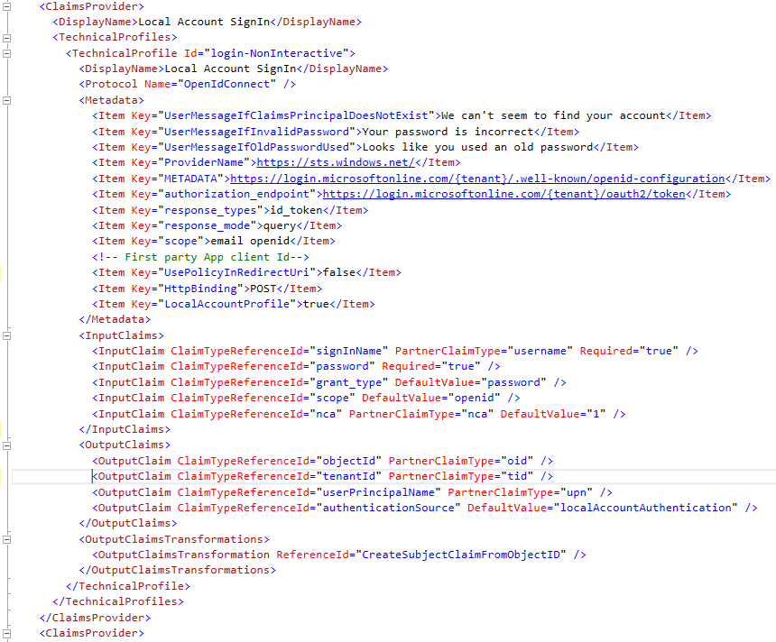

Image 1: Local Account Sign-In policy section

### Facebook Sign-In

> Below technical profile corresponds to that of Facebook identity
> provider. Client Id corresponds to the App ID that you setup in
> Facebook and goes as a direct text in the policy. The "client\_secret"
> corresponds to the App Secret provided by the Facebook app. This is
> provided as a key name "B2C\_1A\_FacebookSecret" in the custom policy
> and not direct text. The key itself is created in the B2C tenant with
> the value extracted from Facebook app.
>
> 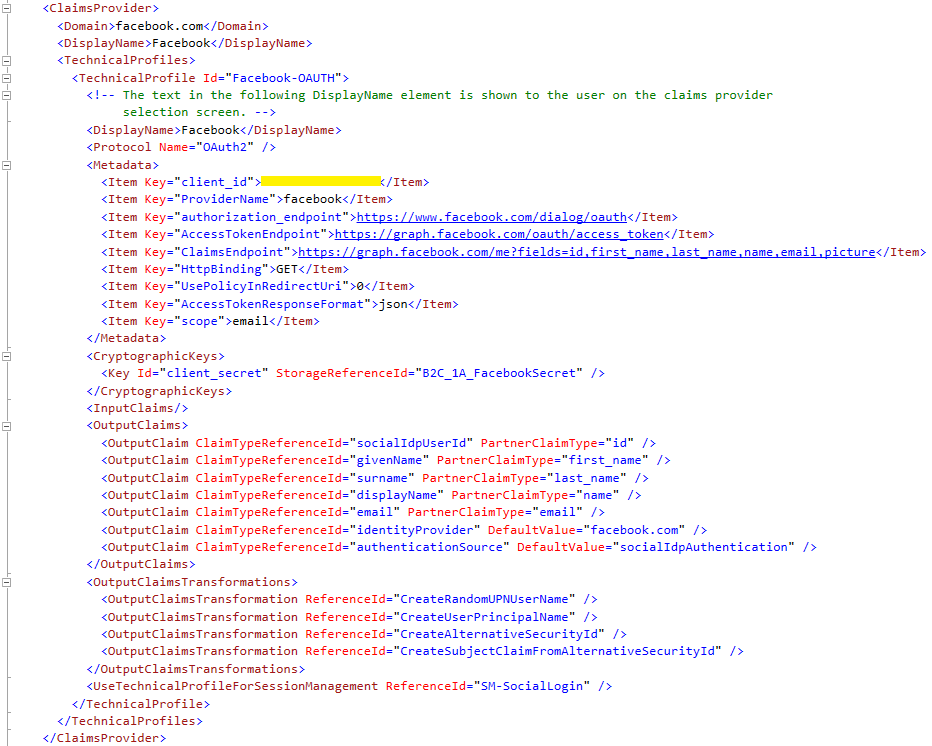

Image 2: Facebook technical profile

> The App ID and App Secret can be found on the basic settings page of
> your Facebook App setup as an Identity provider. Please follow this
> link to setup Facebook as an Identity provider.
>
> 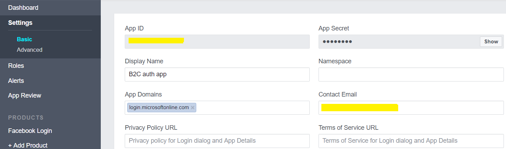

Image 3: Facebook App ID and Secret

> 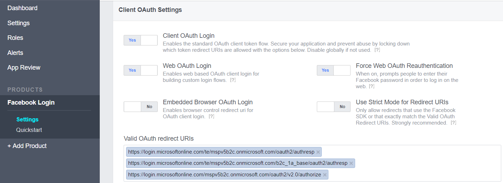

Image 4: Facebook App redirect URIs

### Google Sign-In

> Below technical profile corresponds to that of Google identity
> provider. Like Facebook, client\_id field is extracted from the Web
> Application you create in Google and is recorded as a clear text in
> custom policy. Follow this link to setup Google Identity Provider
> Application. The "client\_secret" corresponds to the App Secret
> provided by the Google app. This is recorded as a placeholder key
> (named "B2C\_1A\_GoogleSecret") in the custom policy's
> "StorageReferenceId" and not direct text. The key itself is created in
> the B2C tenant with the value extracted from Google app.
>
> 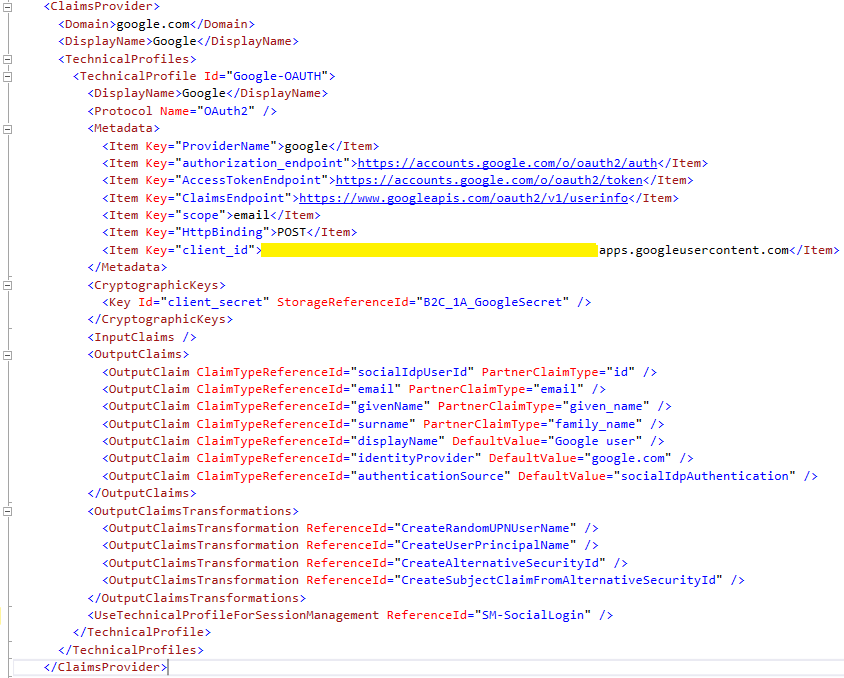

Image 5: Google technical profile

> 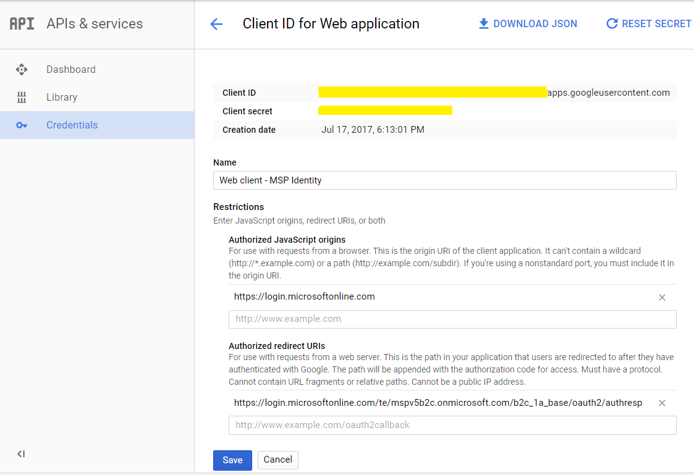

Image 6: Google client ID & secret

### Invoke RESTful APIs

Custom policies provide an ability to invoke RESTful APIs that extends
the out-of-box B2C user experience with the custom platform
implementation. In this reference implementation the RESTful APIs are
invoked upon signup and essentially records the user as a Fan. It
further records the user action (i.e. fan sign-up/sign-in).

Below technical profile in the custom policy corresponds to the first
REST API that gets called upon first user sign-up. Note that the
InputClaims are passed along as parameters to the first REST call.

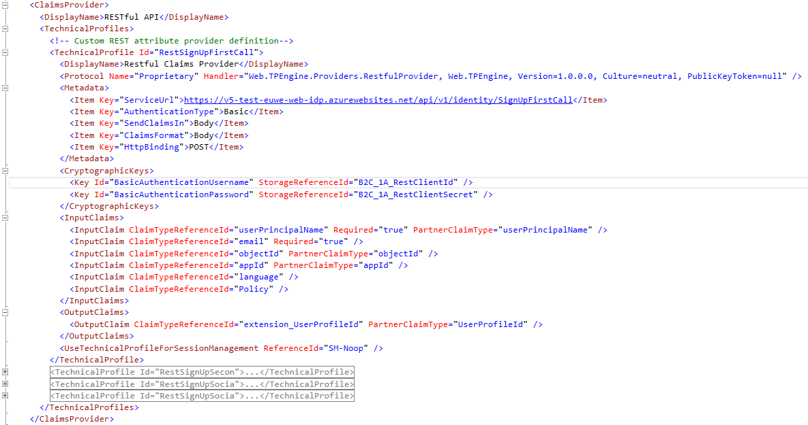

Image 7: Technical Profile for REST Call

Following profile corresponds to the REST API that gets called upon
social sign-up i.e. when sign-in happens from one of the external
identity providers (Facebook/Google). This call also records the
registered user as a Fan in the sports digital platform.

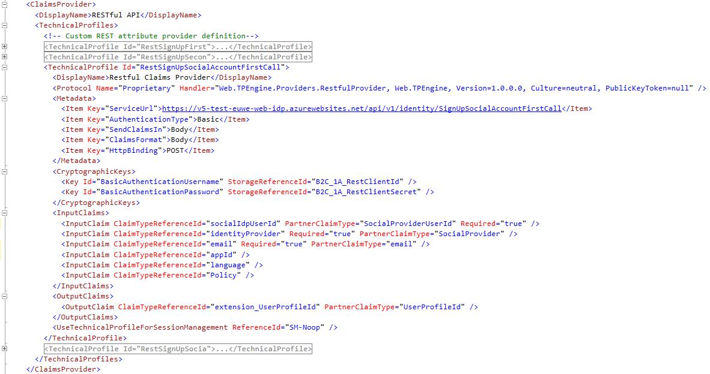

Image 8: Technical profile for Social REST API

Custom policy startup pack will also include default AD related
technical profiles that are used for example to write user profile to
Azure AD B2C. Some of these technical profiles are named as AAD-Common,
AAD-UserWriteUsingAlternativeSecurityId etc (basically those prefixed
with AAD).

### User Journey

Technical profiles described above are combined to provide an end-to-end
user experience. The profile "LocalAccountSignUpWithLogonEmail" in below
image is responsible for invoking the REST call to add the user as Fan
and also create its profile in AD B2C. This is achieved by creating
ValidationTechnicalProfiles as below.

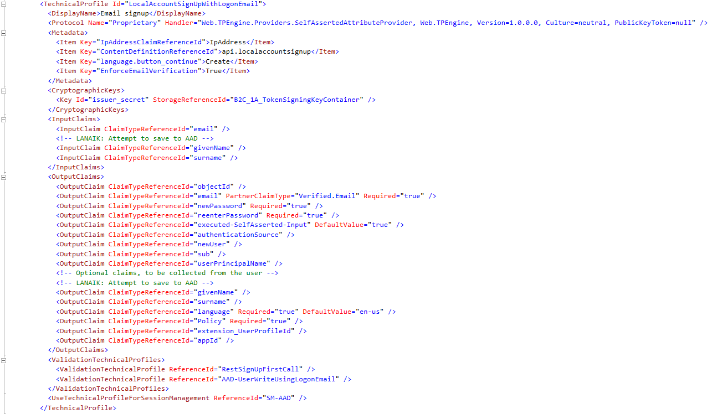

Image 9: LocalAccountSignUpWithLogonEmail technical profile

Similarly, "SelfAsserted-Social" technical profile provides user
experience when user sign-in from external identity providers
(Facebook/Google) by first establishing Fan identity of the user and
later adding user-profile to the AD B2C.

Finally, the User Journey section of the custom policy enlists the
various orchestration steps that are to be executed in the entire
journey. User Journey use technical profiles to orchestrate the overall
sign-up/sign-in journey of the user.

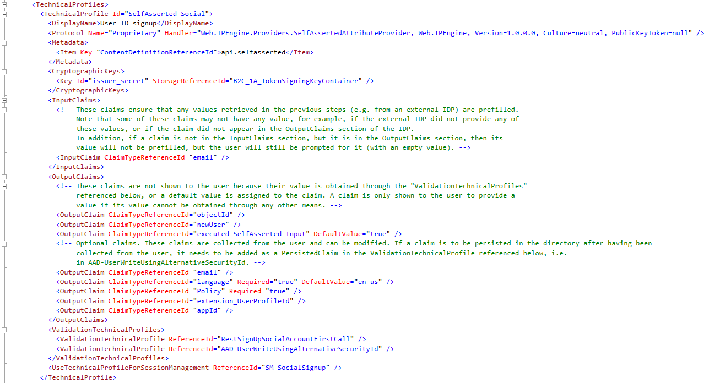

Image 10: SelfAsserted-Social technical profile

### Uploaded Policies

The policies created using the steps listed above are uploaded in the
B2C blade of your Azure AD B2C tenant.

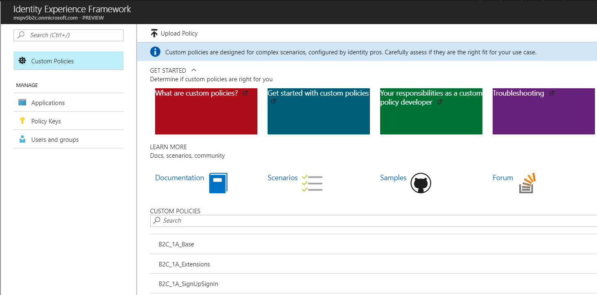

Image 11: Identity Experience Framework B2C blade

The end customer application through which Fans will access the platform
will have to be authenticated in the B2C tenant. B2C will use
application ID to authenticate the app.

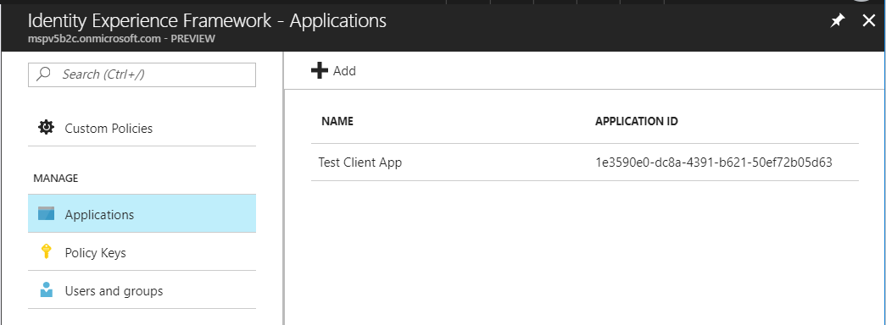

Image 12: Identity Experience Framework- Applications

### Testing Custom Policies

Azure facilitates testing of custom policies through Identity Experience
Framework. Select SignUpSignIn policy from Identity Experience Framework
blade of the B2C.

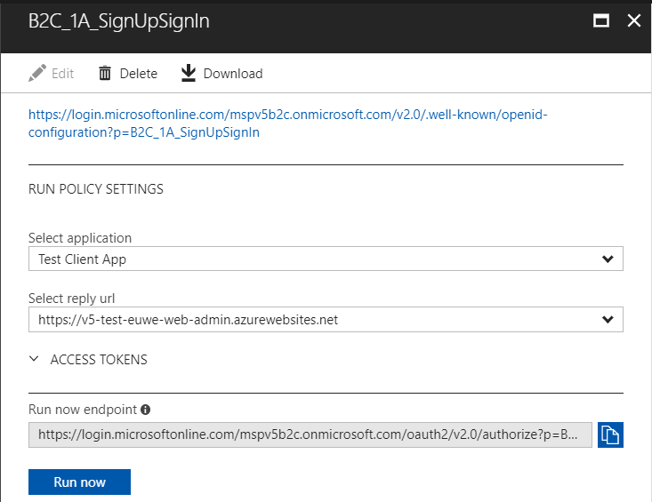

Image 13: Test User Experience- Run now

Select the application that is registered on B2C tenant. Reply URL here
is the redirect URL where B2C will return token. Click on Run now to see
following user sign-up, sign-in page. Notice all the options available
on this page are corresponding to those listed in the User Journey
section of the custom policies. Proceed to test all the flows as created
in your custom policies.

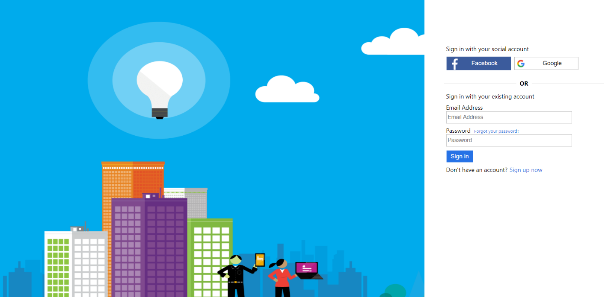

Image 14: Test end-to-end User Experience

Digital Platform Build
======================

Preparing
---------

Before trying to compile the solution, make sure you have the following
software installed:

-   Microsoft Visual Studio 2015 Enterprise with Update 3

-   .NET Framework 3.5

-   .NET Framework 4.6

**Note:** To check whether you have .NET Framework 3.5 and 4.6 enabled
on your machine, go to Start-\>Programs and Features-\> Turn Windows
features on or off and verify that both .NET Framework 3.5 (includes
.NET 2.0 and 3.0) and .NET Framework 4.6 Advanced Services are installed

Compilation
-----------

This section describes the steps required to build the solution from the
command prompt using MSBuild.

1.  Open the Developer Command prompt and navigate to the local folder
    of the solution.

<!-- -->

1.  Navigate to the DigitalPlatform/Build folder and execute.

        MSBuild LocalBuild.proj /p:ConditionDeployOnBuild=true

    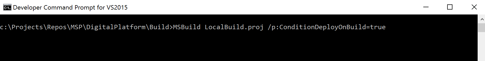

    This may take between 10 and 15 minutes the first time between
    downloading all NuGet packages and actual compilation.

**Note:** Expect warnings during the compilation for several reasons
(XML Missing comm ents, await, unused variables, etc.).

Verification
------------

Once the build completes there will be a new folder
*DigitalPlatform\\Binaries.* If the build completed successfully, there
will be a subfolder called Version with the following structure:

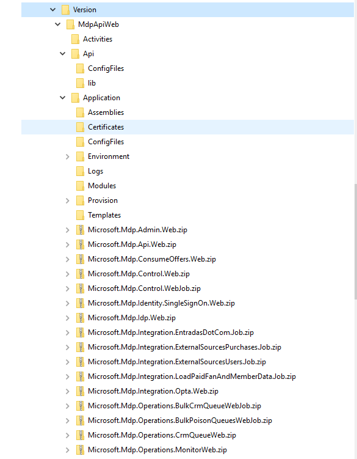

Azure Setup Process
===================

The following process will create all Azure resources required to run
the Core Digital Platform. This process should be run only during the
initial setup of a deployment or during the addition of a new one.

Preparing
---------

Before running the process make sure you have the following
pre-requisites:

-   You have compiled the project following the steps provided in the
    Digital Platform Build section.

-   Before running the command, make sure that you have your
    subscription registered both for Azure Service Management and Azure
    Resource Management.

    Because the script still uses Azure Service Management, your user
    must be co-administrator of the subscription.

    The team is working in a full Azure Resource Management version of
    the scripts, but it will not be possible until all services have a
    resource provider.

-   Create your own Environment Deployment File. Look at Section 4
    Deployment Resources to get an explanation of the different
    components included in the environment and the file description.

    You must know what your environment is going to look like in terms
    of deployments and services available in each deployment.

    A complete environment definition is available at
    *DigitalPlatform\\Deploy\\ConfigFiles\\AzureEnvironmentDeployment.SPORTS.json.*

    You can commit your definition to the repo to keep track of it.

-   Create your own encryption certificates using the makecert utility
    (Windows SDK). They will be used to encrypt the configuration files
    of the environment.

    You can find the commands to create the certificates in the file
    *Digital Platform\\Deploy\\Certificates\\createcert.txt*

-   Note down the Certificate name given in the CN attribute. This
    should be provided in the Azureenvironmentparameters file.

-   After you run the commands, export the PFX and CER files for the
    certificate.[^3^](#fn3){#fnref3 .footnote-ref}

    -   Some screen shots using Microsoft management console for
        Exporting certificates are given below

        [MMC -- Certificate tree node]{.underline}

        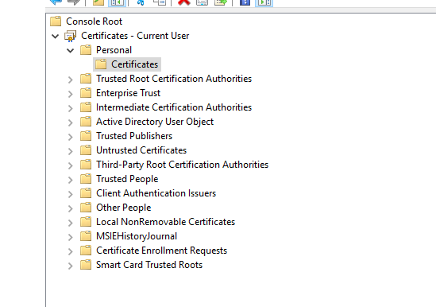

        [Export Certificate screen ]{.underline}

        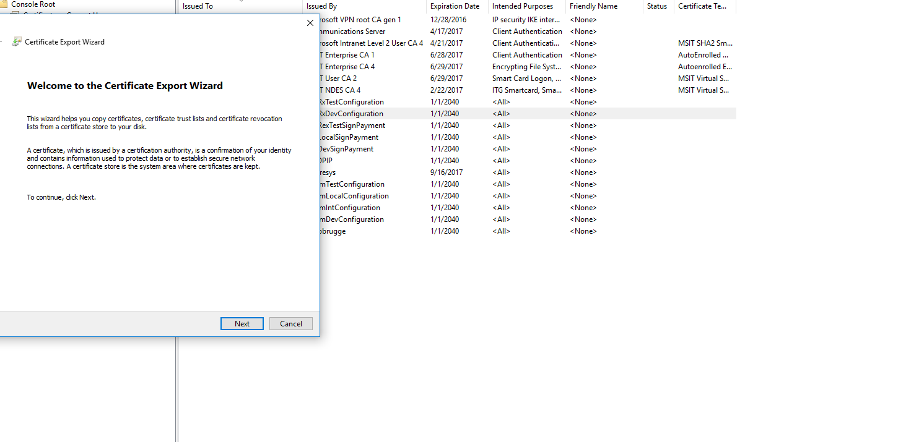

-   Copy the pfx and certificate files into the
    Binaries\\Version\\MdpAPiWeb\\Application\\Certificates folder

-   You can commit your certificates to the repo without the password
    used to export the private key.

Resources Provisioning
----------------------

The provisioning of all resources in Azure requires different steps that
will be described in this section. The deployment will be complete and
functional only when all steps in this section have been successfully
completed.

### Scripted Resource Provisioning

The Core Digital Platform provides scripts to create most of the
resources required to by the solution. These scripts are based on Azure
PowerShell and will provide a log to register all actions executed
during the provisioning.

1.  Update the following tokens in your parameters file (1 Region or 2
    Region depending on the target environment):

    \[custId\]

    \[env\]

    \[globalRegionLocation\]

    \[region1DeploymentId\]

    \[region1Id\]

    \[region1Location\]

    \[region2DeploymentId\]

    \[region2Id\]

    \[region2Location\]

<!-- -->

1.  Execute **MDPShell.cmd** located under
    Binaries\\Version\\MdpApiWeb\\Application\\. This will open and
    initialize a PowerShell window that you can use to run the
    deployment scripts. Also open a new MDPShell for every deployment
    since MDPShell caches modules from previous deployments and you may
    encounter unexpected errors down in the deployment process if you do
    not open a new shell.

2.  Modify the Application insights location in both the template files
    AzureEnvironmentDeployment.2Regions.Template.json and
    AzureEnvironmentDeployment.1Region.Template.json from Central US to
    a location where AppInsights is available . See article - here.

3.  Once you update the parameters file run the following command to
    generate the deployment file updated with your parameters (use the
    values you defined for **\[custId\]** and **\[env\]** token in the
    parameters of the command):

        Merge-MdpTemplateWithParameters -TemplateConfigurationFile .\ConfigFiles\AzureEnvironmentDeployment.2Regions.Template.json -ParametersFile .\ConfigFiles\AzureEnvironmentParameters.[custId].[env].json -OutputFile .\ConfigFiles\AzureEnvironmentDeployment.[custId].[env].json

4.  Run the following commands (3 separate commands), replacing the name
    of your ***subscription*** and the name of your ***config*** file
    that was created in the previous command
    (AzureenvironmentDeployment.\[custid\].\[env\].json): 

        1.Register-MDPDeploymentEnvironment

        2. Connect-MDPAzureSubscription -SubscriptionName "[Subscription Name]"

        3. New-MDPAzureDigitalPlatform -Subscriptio "[Subscription Name]" -ConfigFile .\ConfigFiles\AzureEnvironmentDeployment.CONFIG.json

-   The deployment scripts will have a few interactions:

    -   The PowerShell script will ask you to log in to Azure to get
        access to your subscription.

    -   The same command will also ask you **twice or more** for the
        password to access the PFX certificate private key for each
        resource group where the certificate is uploaded.

**Note:** In case of failure or disconnection the scripts can be run
multiple times without the risk of overwriting already created
resources.

Once the scripts complete the following resources will be created:

-   Azure Resource Groups

-   Azure Storage accounts

-   Azure Notification Hubs

-   Azure Document DB accounts

-   Azure Search accounts

-   Azure App Hosting plans

-   Azure Web Apps

-   Azure Applications Insights

-   Traffic Manager endpoints

### Manual Resource Provisioning

After you have completed the scripted provisioning of the environment,
there are a couple of manual steps that are required to provision some
resources:

#### Azure Notification Hub

Configure an Azure Notification Hub. That will be used to send push
notifications to different Native Apps. You can use the following guide
to [Configure the
Hub](https://azure.microsoft.com/en-us/documentation/articles/notification-hubs-windows-store-dotnet-get-started/#configure-your-notification-hub).[^4^](#fn4){#fnref4
.footnote-ref}

-   You will need at least one hub for all your applications.

-   If you want to keep track of spending per application, you should
    create a hub per application that will be developed.

#### Configuring SSL Certificates for Azure Traffic Manager

> In order for the Azure Traffic Manager to use the HTTPS endpoints, it
> must be properly configured to accept SSL DNS resolution with the
> proper certificates installed on the Traffic Manager domain. See this
> article for more info:
> http://www.hanselman.com/blog/CloudPowerHowToScaleAzureWebsitesGloballyWithTrafficManager.aspx

Environment Configuration Files
===============================

After creating the resources, you must create the environment
configuration file that will be used by all deployment tools included
with the Core Digital Platform. You can find examples of the
configuration files in the source code under
Deploy\\ConfigFiles\\AzureEnvironmentConfiguration.\*.Dev.json.

**Note:** Because keys and access information are stored in the file,
you can choose not to store this file in the shared repo and should be
pushed to the individual project repo.

After creating all resources, you must get all the keys and connections
to include them in the configuration file.

The following is a brief summary of all sections included in the
configuration file with some guidance on where to get the values
required for its configuration.

Resources Configuration
-----------------------

Provides keys and connection string for resources that will be
referenced in the other configuration elements.

-   **Storage accounts.** For every storage account in the Environment
    Deployment file get the connection string and account name.

    -   If the environment is sensitive, put *TOBEDEFINED* in the
        connection string so the script gathers the connection
        information during deployment using the credentials of the user
        executing the script.

    -   Internally, all accounts are referenced by the Name attribute so
        try to keep those constant between environments to correlate the
        accounts.

    -   If your environment is using the same storage account for
        multiple purposes, it is recommended that you keep multiple
        account references to understand the different uses of the
        account.

    -   The suggested storage account references are:

        1.  **cdnsa**: Pointing to the storage account used by the CDN.
            There is only one for all deployments.

        2.  **crmsa**: Pointing to the storage account used to keep
            information used in the synchronization with CRM. Since
            there is only one CRM tenant there is only one account for
            all deployments.

        3.  For every deployment you MUST create the following
            references with the deployment id as a prefix. For instance,
            if the deploymentid is **eu**.

            i.  defaultsa -\> **eu-**defaultsa

            ii. configurationsa -\> **eu-**configurationsa

            iii. useractionssa -\> **eu-**useractionssa

            iv. queuessa -\> **eu-**queuessa

            v.  blobssa -\> **eu-**blobssa

            vi. Jobssa -\> **eu-**Jobssa

-   To help with the environment configuration settings, there is a
    command line for how to get all the storage keys based on the
    AzureEnvironmentDeployment settings:

        .\Get-MDPAzureEnvironmentSettings -Subscription "Subscription Name" -ConfigFile .\ConfigFiles\AzureEnvironmentDeployment.[CustId].[Env].json 

-   **Document DB references**

    -   Make sure to include the right key, administrative, and database
        name.

    -   Consider that MDP only stores the identities in DocDb

    -   Just like with the storage account sensitive keys can be marked
        as *TOBEDEFINED*

-   **Azure Search references**

    -   You will have to create a Query Key to be included in the
        configuration file.

    -   For MDP only one search instance is required to keep data of
        users and groups. However other scripts WILL FAIL if you don\'t
        add the *video platform* reference.

    -   Just like with the storage account sensitive keys can be marked
        as *TOBEDEFINED*

Common Configuration
--------------------

This section has configuration parameters that will be applied to all
deployments. If you have a single deployment environment there is not
much difference between using this section and the deployment
configuration section.

-   **InstrumentationLevel**. Defines the level of instrumentation
    messages to be issued by all the environment.

    -   **Configuration**. There is a single notification Hub for the
        environment so all it is needed is the connection string.

-   **WebApiDeploymentBaseAddress**. In case of a multi-deployment
    environment this should be the Traffic Manager endpoint. Otherwise
    just the base URL of the Web API site, ex.
    https://dg004-dev-euwe-web-api.azurewebsites.net

-   **OptaDeploymentBaseAddress.** Just like Web API but for the service
    that OPTA calls.

    If your environment has to test this integration, you must contact
    OPTA and ask them to register the URL, ex:
    https://dg004-dev-euwe-web-opta.azurewebsites.net

-   **PowershellClientId**. This is the ID used by different deployment
    scripts that call the WebAPI. You have to use the client ID of the
    PowerShell Scripts application created in the admin tenant.

-   **DefaultLanguage**. Self-explanatory

-   **WaadConfiguration**. Configuration used by the Batch job and the
    Web Api to read data and write updates to Azure AD B2C users.

    -   **GraphApiResourceUrl**. The url to Azure Active Directory Graph
        API service (<https://graph.windows.net>).

    -   **GraphApiVerstion**. Current api version

    -   **TenantName**. The AAD B2C tenant name, ex.
        mspfans.onmicrosoft.com

    -   **WaadAuthString**. AAD Login URL: https://login.windows.net/{0}

    -   **WebApiClientId**. The Client ID of the **MSP WAAD Graph Access
        App** in the AAD B2B directory (Note: must be retrieved from the
        old Azure portal)

    -   **WebApiClientSecret**. The Client Key of the **MSP WAAD Graph
        Access App** in the AAD B2B directory (Note: must be retrieved
        from the old Azure portal)

    -   **IdpClientId**. Application ID of the **MDP - Identity
        Provider** application in the AAD B2C directory (Note: must be
        retrieved from the new Ibiza Azure portal)

    -   **AdminsTenant**. The tenant of the AAD admin directory, ex.
        mspadmin.onmicrosoft.com

    -   **WebApiAdminClientId**. Client ID for the MDP - Web API App
        created in Azure B2B.

    -   **WebApiAdminClientSecret**. Secret created for MDP - Web API
        App created in Azure B2B.

-   **Waadsocialconfiguration**:

    -   **TenantId**: \"88c3f7d2-4995-4691-89e7-e8d792a61321\",

    -   **ClientId**: \"88c3f7d2-4995-4691-89e7-e8d792a61321\",

    -   **ServiceUserId**: \"TOBEDEFINED\",

    -   **ServiceUserPassword**: \"TOBEDEFINED\",

    -   **ProvisioningUrl**: \"TOBEDEFINED\",

    -   **GraphApiResourceUrl**: \"TOBEDEFINED\",

    -   **AuthorityUrl**: \"TOBEDEFINED\",

    -   **FacebookProviderName**: \"TOBEDEFINED\",

    -   \"GoogleProviderName\": \"TOBEDEFINED\"

-   **OperationsConfiguration**. This is the configuration used by the
    jobs that monitor the website.

    -   The **TenantId** is the id of the Admin AD you created. (copied
        from the URL address line of the AAD directory tenant, ex.
        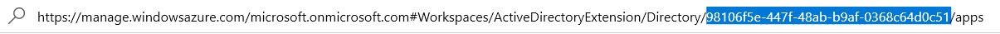

    -   The **Subscription ID** is the Azure Subscription ID where you
        are hosting the solution.

    -   The **ClientId** and **ClientSecret** come from the **MDP - Web
        Operations** app your created in Azure Admin while configuring
        apps.

        Make sure that the application [has access to Azure Service
        Management]{.underline} in Azure AD.

-   **CDNConfiguration**. Point to the cdnsa storage account reference
    and include the CDN endpoint URL.

-   **SubscriptionTokenConfiguration**. TODO

-   **AkamaiTokenConfiguration** : TODO

-   **DRMConfiguration** : TODO

-   **OfficialAppsIdClientGroup**. This is the ID of the applications in
    the BackOffice. During initial deployment use any value and then
    adjust to the right one.

-   **TwitterConfiguration**. You will have to register as a developer
    in the social network site to get this info.

-   **FacebookConfiguration**. You will have to register as a developer
    in the social network site to get this info.

-   **GoogleConfiguration**. You will have to register as a developer in
    the social network site to get this info.

-   **QRCodeDefaultConfiguration**. TODO

-   **SMTPClientConfiguration** : TODO

-   **PicturesConfiguration**. For every type of pictures (blobs) to be
    stored you can configure the image processing to be applied. Most
    properties are self-explanatory

    For an example of the suggested configuration check at
    DigitalPlatform\\Deploy\\ConfigFiles\\AzureEnvironmentConfiguration.SPORTS.json

-   **BlobStorageConfiguration**. Defines what containers to create and
    their characteristics.

    For an example of suggested configuration look at
    *DigitalPlatform\\Deploy\\ConfigFiles\\AzureEnvironmentConfiguration.Dev.json*

-   **CacheConfiguration**. Amount of time in minutes to keep objects in
    cache.

-   **SingleSignOnWebConfiguration**. TODO

-   **BackOfficeConfiguration**. Login configuration for the Admin
    website. These settings are based on the **MDP - Web Admin App**
    that was configured previously in the admin AAD.

    -   **ClientId**. Client ID for the MDP - Web Admin App.

    -   **AADInstance**. AAD Login URL: https://login.windows.net/

    -   **PostLogoutRedirectUri**. The URL of the Web Admin site that
        was created during deployment, ex.
        https://dg004-dev-euwe-web-admin.azurewebsites.net

    -   **WebApiUrl**. The URL for the Web API site created during
        deployment, including the api and the latest API version suffix,
        ex.

        https://dg004-dev-euwe-web-api.azurewebsites.net/api/v1/

    -   **Resource**. The App ID URI of the MDP - Web API App in the
        Admin Azure AD, ex. <http://dg004.digitalplatform.ms/web/api>

-   **ConsumeOffersConfiguration**. TODO

-   **IdpConfiguration**. Defines how the IDP website will communicate
    with Azure B2C. Most of the parameters here come from the **MDP -
    Identity Provider** app created in the B2C directory.

    -   **ClientId**. The client ID of the MDP - Identity Provider app

    -   **ClientSecret**. The client secret for the MDP - Identity
        Provider app

    -   **RedirectUri**. The traffic manager URL of the IDP app.

    -   **WebApiUrl**. The traffic manager URL of the Web API.

    -   **Resource**. The App ID URI of the MDP - Web API App in the
        Admin Azure AD.

    -   **SignUpPolicyId**. The sign up policy ID created for the Fan
        B2C.

    -   **SignInPolicyId**. The sign in policy ID created for the Fan
        B2C.

    -   **IdpAADInstancesConfiguration**.

        1.  **PolicyName**. The B2C signing policy name

        2.  **AADInstance**. The Microsoft Online Login URL:
            https://login.microsoftonline.com/

-   **PurchaseWebConfiguration**. TODO

-   **ConexflowGatewayConfiguration**. TODO

-   **MaxMindConfiguration**. TODO

-   **SFTPConfiguration**. TODO

-   **ApiConfiguration**. Information about authentication and
    authorization in the API layer.

    -   Replace the name of the **FansTenant** and **AdminsTenant**
        Active Directories that you will be using in your deployment.

    -   **Audiences**. Add the audiences:

        1.  The **Web API Uri** for the MSP Web API App as defined in
            the Admin Tenant, ex.
            <https://dg004-dev-euwe-web-api.azurewebsites.net/>

        2.  The **App Id** for the MSP Web API App as defined in the
            Admin Tenant, ex. <http://dg004.digitalplatform.ms/web/api>

        3.  The **Application Id** for the MSP Web API App as defined in
            the B2C Tenant, ex. 6d027ed7-4a93-4317-803a-2764ec02afb1, or
            see the screenshot example below:

            

    <!-- -->

    -   **Issuer.** Set the issuer array to the
        [https://sts.windows.net/***tenantid***](https://sts.windows.net/tenantid)
        replacing tenantId with the tenant ID of the Fan's tenant active
        directory (copied from the URL address line, like shown earlier
        in this document).

        **Note**: You DO NOT need to set the Issuer for B2C. This is
        configured based on the sign-in policy.

-   **ProcessConfiguration**. Configuration values for WebJobs.

-   **CommonManagementDeployConfiguration**.

    -   **Audiences**. Set this value to the App UDI URI of the MDP -
        Web control App created in the admin AAD.

    -   **AdminsTenant**. Set this value to your admin tenant name
        (i.e.: contoso.onmicrosoft.com)

-   **CommonJobsDeployConfiguration**. Standard configuration for all
    WebJobs.

    -   **Authority**. Update this URL to point to your admin tenant.

    -   **JobClientId**. Client ID for the **MDP - Web Control App**
        created in the admin AAD.

    -   **JobClientSecret**. The Key for the **MDP - Web Control App**
        created in the admin AAD.

    -   **ControlResourceId**. The App ID for the **MDP - Web Control
        App** created in the admin AAD.

-   **QueuesConfiguration**. Defines what queues to create and their
    characteristics.

    For an example of suggested configuration look at
    *DigitalPlatform\\Deploy\\ConfigFiles*

-   **LoadContentsConfiguration**. Sources of content to be crawled. If
    the XML matches the definition is a single point to provide content
    to the platform.

-   **LoadMatchFeedsConfiguration**. TODO

-   **LoadPaidFanConfiguration** : TODO

-   **SyncMembersConfiguration**

-   **ExternalSourcesConfiguration**. TODO

-   **IntegrationConfiguration**. TODO

-   **RMServicesConfiguration**. TODO

-   **EntradasDotComConfiguration**. TODO

-   **XpRankingCalculationConfiguration**. TODO

-   **RankingScoreConfiguration**. TODO

-   **CleanUpOffersProcessConfiguration** TODO

-   **CleanUpFavoriteActionsProcessConfiguration** TODO

-   **SyncFavoriteActionsProcessConfiguration** TODO

-   **Recurringpurchasesprocessconfiguration** TODO

-   **CRMConfiguration**. Configuration for the integration process run
    against CRM.

-   **PurchaseValidationConfiguration**. Configuration for the apps to
    validate purchases.

-   **VideoPlatformConfiguration**. See the Video Platform Deployment
    Guide.

-   **AzureSearchCommonConfiguration**. Configuration used by indexers.
    Defines where the indexes will be created and where to get the data
    from.

-   **ContentConfiguration**. TODO

-   **SeasonConfiguration**. TODO

-   **SqlServerConnectionConfiguration**. TODO

-   **AVETServicesConfiguration** TODO**\
    **

Deployment configuration.
-------------------------

In this section specific values can be provided for every deployment
based on the ID.

-   **DeploymentId**. A unique identifier used to prefix all the
    components in the deployment, it is normally a two letter
    abbreviation for the region.

-   **ReplicationDeployments**. Where to replicate data ingested in the
    deployment.

-   **ConfigurationAccountReference**. Storage account where the
    encrypted configuration files will be stored.

-   **CoreDeployConfiguration**. Storage and Document DB accounts where
    the master data will be stored.

-   **BlobStorageAccountReference**. Storage account where blobs
    (pictures and similar) will be stored.

-   **NotificationConfiguration**. TODO

-   **JobsDeployConfiguration**. Storage account to be used by the
    WebJobs.

-   **CacheDeployConfiguration**. TODO

-   **EventHubReferences**. TODO

-   **VideoEventHubReferences**. TODO

-   **WebSitesReference**. Used to associate web sites with App Insight
    instances.

-   **WebJobsReference**. Configuration of WebJobs.

    -   Maps the AppInsight instance.

    -   Maps the to be watched by the WebJob.

-   **StorageAccountEntityConfiguration**. Storage account where user
    actions will be stored.

-   **DocDBCollectionConfiguration**. Indicates what collections should
    be created.

-   **ContainerConfiguration**. TODO

-   **AzureSearchDeployConfiguration**. Indicates what search service
    the deployment will use.

Master Data Provisioning
========================

After you deploy all resources in Azure, you must configure and
provision all data required for the MDP to work.

**Note:** Before running the steps described in this section, you must
have completed completely the steps in Section 7.2 Resources
Provisioning.

The master data is information about languages, countries, and other
reference information that is required to setup the Digital Platform.
Most of the information provisioned in this stage will be stored in the
Document DB Account.

1.  Execute MDPShell.cmd located under
    Binaries\\Version\\MdpApiWeb\\Application\\.

<!-- -->

1.  If you have parameters masked as *TOBEDEFINED* in your Environment
    Configuration file, make sure that you have your subscription
    registered both for Azure Service Management and Azure Resource
    Management before going to the next step.

2.  Make sure that there is no Environment configuration tmp file in the
    Config file folder. If it is there due to a previous run, delete the
    file before running the following commands.

3.  Run the following commands replacing the name of your subscription
    and the name of your config file:

        .\DeployArtifacts.ps1 -ConfigurationFilePath .\ConfigFiles\AzureEnvironmentConfiguration.[Env].json -Subscription "Subscription Name"

        .\ProvisionMasterData.ps1 -ConfigurationFilePath .\ConfigFiles\AzureEnvironmentConfiguration.[Env].json

        .\ProvisionInitialData.ps1 -ConfigurationFilePath.\ConfigFiles\AzureEnvironmentConfiguration.[Env].json -environmentfolder [Env]

If you haven\'t setup a games history folder for your environment expect
an error in the last script. However, the environment will be
functional. 

This script can be run multiple times in case of disconnection or
failure without any impact on previously provisioned data.

Release Deployment
==================

After you have setup the environment and provisioned the initial data,
you can deploy the binaries of the application to your environment. This
procedure should be implemented as part of the Application Lifecycle
Management Strategy of the project.

**Note:** The release process must always be run after running a local
build to make sure the latest version of the package is in the right
location.

 

1.  Execute MDPShell.cmd located under
    Binaries\\Version\\MdpApiWeb\\Application\\.

    If you have parameters masked as TOBEDEFINED in your Environment
    Configuration file, make sure that you have your subscription
    registered both for Azure Service Management and Azure Resource
    Management before going to the next step.

    Because the script still uses Azure Service Management, your user
    must be an administrator of the subscription.

<!-- -->

1.  Update the remaining tokens in your parameter file with the keys for
    the resources and AAD settings that you created in the previous
    steps and regenerate the configuration file by running:

        Merge-MdpTemplateWithParameters -TemplateConfigurationFile .\ConfigFiles\AzureEnvironmentConfiguration.2Regions.Template.json -ParametersFile .\Deploy\ConfigFiles\AzureEnvironmentParameters.[custId].[env].json -OutputFile .\ConfigFiles\AzureEnvironmentConfiguration.[custId].[env].json

2.  Run the following commands replacing the name of your subscription,
    the name of your config file, and your certificate public key file:

        Register-MDPDeploymentEnvironment

        Connect-MDPAzureSubscription -SubscriptionName "Subscription Name"

        .\ParallelDeploy.ps1 -ConfigurationFilePath .\ConfigFiles\AzureEnvironmentConfiguration.[Env].json -Subscription "Subscription Name" -CertToEncryptFilePath .\Certificates\[Certificate File Name].cer

    Additionally, you can specify the following parameters

    -   **OnlyUpdateConfiguration**. Set it to *\$true* to avoid
        redeploying the apps and only update the configuration files.

    -   **SlotName**. By default, all applications are deployed to the
        staging slot. You can specify a different slot with this
        parameter. If this is your first run, you may want to run it
        with slot **Production** to have a functional site.

    -   **CheckPublishVersion**. Set it to *\$true* to check the version
        being published.

3.  (Skip this step if you used the SlotName \"Production\" parameter in
    the previous step)

    In the standard cycle, you will deploy to Staging and after
    completing tests you will enable your application in production by
    doing a swap. To do so, execute the following commands replacing the
    name of your subscription, the name of your config, file and your
    certificate public key file.

        .\ParallelSwap.ps1 -ConfigurationFilePath .\ConfigFiles\AzureEnvironmentConfiguration.[Env].json -Subscription "Subscription Name"

Data Provisioning
=================

Application Data
----------------

Finally, the applications will need some basic information about their
registration. To provision that information, follow the next steps.

1.  Execute MDPShell.cmd located under
    Binaries\\Version\\MdpApiWeb\\Application\\.

<!-- -->

1.  Open the **EnvironmentData.json** file located in the Application
    folder and add your environment specifying the CDN endpoint and the
    ID of your applications for phone and tablet.

-   Ensure there\'s an entry for the environment you are deploying
    defined.

-   Use the client IDs for the apps you created in Azure B2C.

-   Set the CDN Url.

1.  Run the following commands replacing the name of your subscription
    and the name of your environment:

        .\ProvisionApplicationData.ps1 -ConfigurationFilePath .\ConfigFiles\AzureEnvironmentConfiguration.[Env].json -environment [Env] -platform Tablet

        .\ProvisionApplicationData.ps1 -ConfigurationFilePath .\ConfigFiles\AzureEnvironmentConfigurationz.[Env].json -environment [Env] -platform Phone

Team Statistics
---------------

The teams, players and their association are usually provided by third
parties, which means we have to simulate this content and then update
it. If you want, you can import other statistics to have a more complete
set of data.

1.  Execute MDPShell.cmd located under
    Binaries\\Version\\MdpApiWeb\\Application\\.

<!-- -->

1.  Run the following commands replacing the name of your config file:

        #Football statistics

        .\ProvisionMasterFootballStatistics.ps1 -ConfigurationFilePath .\ConfigFiles\AzureEnvironmentConfiguration.Environment.json -FeedType F1

        .\ProvisionMasterFootballStatistics.ps1 -ConfigurationFilePath .\ConfigFiles\AzureEnvironmentConfiguration.Environment.json -FeedType F40

        .\ProvisionMasterFootballStatistics.ps1 -ConfigurationFilePath .\ConfigFiles\AzureEnvironmentConfiguration.Environment.json -FeedType F9

        .\ProvisionMasterFootballStatistics.ps1 -ConfigurationFilePath .\ConfigFiles\AzureEnvironmentConfiguration.Environment.json -FeedType F13

        .\ProvisionMasterFootballStatistics.ps1 -ConfigurationFilePath .\ConfigFiles\AzureEnvironmentConfiguration.Environment.json -FeedType F28

        .\ProvisionMasterFootballStatistics.ps1 -ConfigurationFilePath .\ConfigFiles\AzureEnvironmentConfiguration.Environment.json -FeedType F3

        .\ProvisionMasterFootballStatistics.ps1 -ConfigurationFilePath .\ConfigFiles\AzureEnvironmentConfiguration.Environment.json -FeedType F15

        .\ProvisionMasterFootballStatistics.ps1 -ConfigurationFilePath .\ConfigFiles\AzureEnvironmentConfiguration.Environment.json -FeedType F37

        #Basket statistics

        .\ProvisionMasterBasketStatistics.ps1 -ConfigurationFilePath .\ConfigFiles\AzureEnvironmentConfiguration.Environment.json -FeedType CMP

        .\ProvisionMasterBasketStatistics.ps1 -ConfigurationFilePath .\ConfigFiles\AzureEnvironmentConfiguration.Environment.json -FeedType CNC

        .\ProvisionMasterBasketStatistics.ps1 -ConfigurationFilePath .\ConfigFiles\AzureEnvironmentConfiguration.Environment.json -FeedType CSF

        .\ProvisionMasterBasketStatistics.ps1 -ConfigurationFilePath .\ConfigFiles\AzureEnvironmentConfiguration.Environment.json -FeedType POB

    This script can be run multiple times in case of disconnection or
    failure without any impact on previously provisioned data.

Application Resources
---------------------

Applications will need images and style files that have to be
provisioned as metadata and in the storage account. To do so follow
these steps:

1.  Execute MDPShell.cmd located under
    Binaries\\Version\\MdpApiWeb\\Application\\.

<!-- -->

1.  Run the following commands replacing the name of your config file:

        .\DeployImages.ps1 -ConfigurationFilePath .\ConfigFiles\AzureEnvironmentConfiguration.Environment.json 

        .\DeployBadges.ps1 -ConfigurationFilePath .\ConfigFiles\AzureEnvironmentConfiguration.Environment.json

        .\DeployPlayerPictures.ps1 -ConfigurationFilePath .\ConfigFiles\AzureEnvironmentConfiguration.Environment.json

        .\DeployPlayerContentFootball.ps1 -ConfigurationFilePath .\ConfigFiles\AzureEnvironmentConfiguration.Environment.json

        .\DeployPlayerContentBasket.ps1 -ConfigurationFilePath .\ConfigFiles\AzureEnvironmentConfiguration.Environment.json

This script can be run multiple times in case of disconnection or
failure without any impact on previously provisioned data.

Appendix A: Application Role Definitionz
========================================

The following JSON piece is the list of Application Roles required by
the application. Although it is not necessary, it is strongly suggested
to create new IDs for every environment.

    {

      "allowedMemberTypes": [

        "User"

      ],

      "description": "Can manage content for the registered applications",

      "displayName": "Content Administrator",

      "id": "1795d11b-9ba3-42de-93d1-0216e4210b8a",

      "isEnabled": true,

      "value": "ContentAdmin"

    },

    {

      "allowedMemberTypes": [

        "User"

      ],

      "description": "Can manage applications and the digital platform configuration",

      "displayName": "Digital Platform Administrator",

      "id": "da67a061-43c2-468c-b2b3-57a74ce03567",

      "isEnabled": true,

      "value": "PlatformAdmin"

    }

Appendix B: Parameter file tokens
=================================

  TOKEN
  --------------------------------------------------------------------------------
  General settings
  \[custId\]
  \[env\]
  [[]{#OLE_LINK6 .anchor}]{#OLE_LINK5 .anchor}\[azureSubscriptionId\]
  \[globalRegionLocation\]
  AAD admin tenant settings and apps
  \[[[]{#OLE_LINK17 .anchor}]{#OLE_LINK16 .anchor}adminTenantName\]
  \[adminTenantId\]
  \[webApiAdminClientId\]
  \[webApiAdminClientSecret\]
  \[webApiAdminClientId\]
  \[webApiAdminClientSecret\]
  \[[[]{#OLE_LINK25 .anchor}]{#OLE_LINK24 .anchor}webControlAppClientId\]
  \[[[]{#OLE_LINK27 .anchor}]{#OLE_LINK26 .anchor}webControlAppClientSecret\]
  \[[[]{#OLE_LINK21 .anchor}]{#OLE_LINK20 .anchor}operationsAppClientId\]
  \[[[]{#OLE_LINK23 .anchor}]{#OLE_LINK22 .anchor}operationsAppClientSecret\]
  \[[[]{#OLE_LINK19 .anchor}]{#OLE_LINK18 .anchor}powershellScriptsAppClientId\]
  AAD B2C Tenant settings and apps
  \[fansTenantName\]
  \[fansTenantId\]
  \[webApiB2CClientId\]
  \[webApiB2CClientSecret\]
  \[idpAppClientId\]
  \[idpAppClientSecret\]
  \[webApib2cAppClientId\]
  \[officialAppsIdClientGroupGuid\]
  \[uwpPhoneAppId\]
  \[uwpTabletAppId\]
  \[andPhoneAppId\]
  \[andTabletAppId\]
  \[iosPhoneAppId\]
  \[iosTabletAppId\]
  Video Platform settings
  \[videoPlatformSearchServiceName\]
  \[videoPlatformSearchServiceAdminApiKey\]
  \[videoPlatformSearchServiceSearchApiKey\]
  Global storage accounts keys
  \[[[]{#OLE_LINK10 .anchor}]{#OLE_LINK9 .anchor}cdnsaKey\]
  \[[[]{#OLE_LINK12 .anchor}]{#OLE_LINK11 .anchor}crmsaKey\]
  \[[]{#OLE_LINK13 .anchor}conexflowsaKey\]
  \[[[]{#OLE_LINK15 .anchor}]{#OLE_LINK14 .anchor}ticketsdotcomsaKey\]
  Global notifications hub
  \[notificationHubGlobalKey\]
  Region parameters (replace X by a region number
  \[regionXDeploymentId\]
  \[regionXLocation\]
  \[regionXId\]
  \[configurationsaRegionXKey\]
  \[mainsaRegionXKey\]
  \[useractionssaRegionXKey\]
  \[queuessaRegionXKey\]
  \[blobsaRegionXKey\]
  \[rankingssaRegionXKey\]
  \[documentDbRegionXKey\]
  \[searchAdminApiRegionXKey\]
  \[searchQueryRegionXKey\]

Appendix C: How to enable Implicit flow
=======================================

**Reference:**
<http://stackoverflow.com/questions/29326918/adal-js-response-type-token-is-not-supported>

+-----------------------------------------------------------------------+
| If you are building client-side app, you need to enable Implicit flow |
| from the application manifest.                                        |
|                                                                       |
| \"oauth2AllowImplicitFlow\": true,                                    |
|                                                                       |
| 1.  Open your application configuration azure portal, and *download*  |
|     > the manifest file from \"**Manage Manifest**\" menu.            |
|                                                                       |
|    |
|                                                                       |
| 2.  Search for **oauth2AllowImplicitFlow** and change the value to    |
|     > true.                                                           |
|                                                                       |
| 3.  **Upload** the file again through the same menu.                  |
|                                                                       |
| Logout and login again to your app and it will work will a charm.     |
|                                                                       |
| The implicit grant type is used for mobile apps and web applications  |
| (i.e., applications that run in a web browser), where the client      |
| secret confidentiality is not guaranteed.                             |
+-----------------------------------------------------------------------+

Appendix D: Exporting certificate with private key
==================================================

Reference:
<http://powershell.com/cs/blogs/tips/archive/2009/10/20/exporting-certificate-with-private-key.aspx>

Certificates are digital identities, and when you already own the
private key to a certificate, you own this identity. You can then use
these certificates to sign e-mail or PowerShell scripts. To prevent
personal certificates from getting lost, you should export them to pfx
files and re-import them in case your machine breaks down or if you are
switching machines.

First, let\'s see how to find certificates that you have already have
the private key for. Use this to find all such certificates in your
personal store:

dir cert:\\currentuser\\my \| Where-Object { \$\_.hasPrivateKey }

Try this to see all machine certificates (provided you are Admin):

dir cert:\\localmachine\\my \| Where-Object { \$\_.hasPrivateKey }

For example, if you want to copy the certificate to another computer to
use it there or as a backup, you should export a certificate with a
private key by first grabbing it by adding a where-object clause to
identify it. Or, you can export and backup all certificates in one line:

dir cert:\\currentuser\\my \|\
Where-Object { \$\_.hasPrivateKey } \|\
Foreach-Object { \[system.IO.file\]::WriteAllBytes(\
\"\$home\\\$(\$\_.thumbprint).pfx\",\
(\$\_.Export(\'PFX\', \'secret\')) ) }

This will export all of your personal certificates, including private
key to pfx-files in your user profile. Each file uses the certificate
thumbprint as its file name.

Before you can re-import such pfx-files by double-clicking them, you
will be prompted for a security password so unauthorized persons cannot
steal your identities. While the line has set this password to
\'secret,\' you should, of course, choose a stronger one.

::: {.section .footnotes}

------------------------------------------------------------------------

1.  ::: {#fn1}
    See
    <https://technet.microsoft.com/en-us/library/dd772285.aspx>[↩](#fnref1){.footnote-back}
    :::

2.  ::: {#fn2}
    You can find instructions on how to create Application Roles in the
    following pages:
    <https://azure.microsoft.com/en-us/documentation/samples/active-directory-dotnet-webapp-roleclaims/>
    and
    <http://www.dushyantgill.com/blog/2014/12/10/roles-based-access-control-in-cloud-applications-using-azure-ad/>[↩](#fnref2){.footnote-back}
    :::

3.  ::: {#fn3}
    A guide to do it from the command line can be found at [Appendix D
    Exporting Certificate with private
    key](#appendix-d-exporting-certificate-with-private-key) . Another
    option is to use the Microsoft Management (mmc) console to do the
    export operation[↩](#fnref3){.footnote-back}
    :::

4.  ::: {#fn4}
    You can use the ARM Azure Portal to create the Hubs and avoid
    requiring co-administrative privileges.[↩](#fnref4){.footnote-back}
    :::
:::
